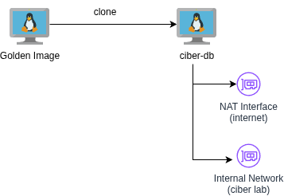
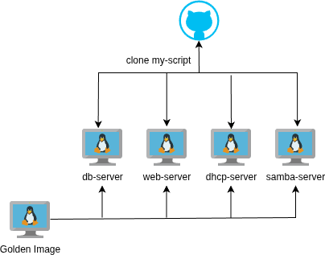
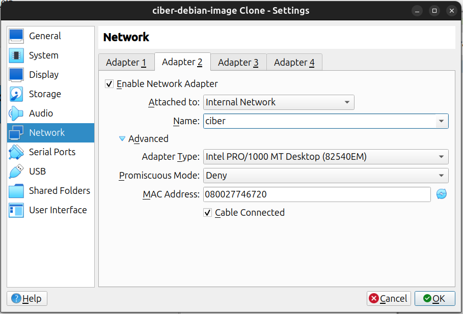
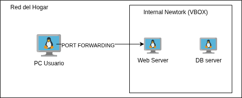
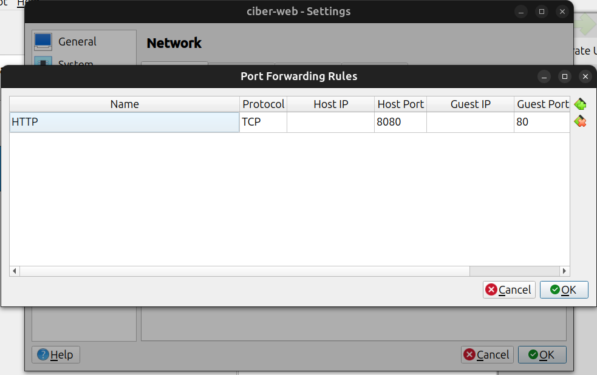

# Laboratorio "Ciber Dioses"

## 1. Informacion general

El laboratorio "Ciber Dioses" es un proyecto que, mediante 4 servidores o maquinas virtuales debian 13, conforma un sistema de Cibercafe, un negocio muy popular de la decada del 2000.

## 2. Como funciona

Para lograr el sistema de cibercafe, vamos a necesitar una "golden-image", o, imagen base, que va a ser el sistema operativo que corra en los 4 servidores.
Esta imagen base tendra instalados los paquetes minimos necesarios para todas las VMs. Luego, en cada una, se instalaran paquetes necesarios para cada fin, ejemplo, php en el webserver, mysql en el db-server, etc.

### Paquetes en comun para la golden image

Este es un listado de lo que necesitamos en cada VM y una descripcion breve de para que sirve cada uno

-  sudo: Ejecutar comandos como root
-  vim: Editor de texto
-  nano: Editor de texto simple
-  curl: Probar endpoints/hosts
-  wget: Descargar archivos
-  git: Clonar repositorios
-  net-tools: ifconfig, netstat, etc (pruebas networking)
-  iproute2: ip addr, ip route (mas pruebas de networking)
-  dnsutils: nslookup, dig (aun mas pruebas de networking)
-  openssh-server: Acceso SSH (ademas del paquete, debe configurarse el puerto 22035)
-  rsync: Backups y sincronización
-  unzip: Descomprimir ZIP
-  zip: Comprimir ZIP
-  htop: Ver procesos y consumo
-  tree: Ver estructura de directorios
-  less: Visualizar archivos largos

Nota: Si bien varios paquetes ya vienen incluidos en debian 13, es mejor instalar todo en la golden image para que luego no nos falte ninguno.

### IPs privadas para la red interna

Para que las VMs puedan verse entre si, se va a generar una red interna.
Para eso, se van a usar 2 placas de red por servidor. Una de tipo NAT, para poder salir a internet e instalar todo lo necesario, y la otra de tipo "Internal Network", para hablar con el resto de las VMs del laboratorio.

El primer paso luego de clonar la golden image y encender la VM, tiene que ser asignar una ip privada a la placa de red correspondiente

Este paso, dada la complejidad necesaria en el codigo, es el unico que no esta automatizado por scripts.
Por otro lado, el cambio de hostname, y la inclusion de los hosts en /etc/hosts, si esta automatizado

  

### Scripts para cada servidor

Para facilitar la instalacion de todo lo que se necesita en cada servidor, y no tener que correr cada uno de los comandos "manualmente", se armaron scripts en shell, y se subieron a github, para poder descargarlos en cada VM, y correrlos para instalar y configurar lo que se necesite.

Nota: Para poder clonarnos los repositorios sin tener que configurar usuarios de git en cada VM, subimos los scripts a repositorios publicos. Esta practica en ambitos corporativos es insegura, pero sirve para el laboratorio. Nunca se deben incluir credenciales de base de datos o informacion sensible en un repositorio publico

  

### Breve ejemplo de un script

Una vez que desplegamos el primer servidor, por ejemplo, ciber-db, y configuramos su ip interna, ya estamos listos para ejecutar el script de inicializacion o init.
Dentro de la VM, en la terminal, ejecutamos

~~~ bash
# para clonar el repo
git clone https://github.com/aleconde12/lab-dioses-scripts.git

# para ejecutar el script
bash ./lab-dioses-scripts/db/db-init.sh
~~~

Dicho script contiene cosas genericas (para todos los scripts) como

~~~ bash
#!/bin/bash

set -e

# Definir hostname y /etc/hosts

grep -q "# Laboratorio Ciber" /etc/hosts || cat >> /etc/hosts << 'EOF'

# Laboratorio Ciber
192.168.100.10 ciber-db
192.168.100.20 ciber-web
192.168.100.30 ciber-dhcp
192.168.100.40 ciber-files

EOF

NEW_HOSTNAME="ciber-db"

hostnamectl set-hostname "$NEW_HOSTNAME"

echo "Hostname configurado como: $NEW_HOSTNAME"

~~~

Esto lo que hace es, que el script deje de ejecutarse si se encuentra con algun error (set -e), que defina las ips y los hostnames dentro de /etc/hosts, que defina el hostname como "ciber-db" en este caso, y de ahi en mas, seguir con sus funciones. Eso lo veremos en detalle por cada uno de los servidores.

## 3. Golden image

Como se menciono anteriormente, se instalan varios paquetes en la golden ami para que esten presentes en todos los servidores a la hora de clonarlos.
Esto nos da un estandar, y nos aseguramos de que a ningun servidor le va a faltar algun paquete o alguna configuracion que es comun a todo el laboratorio.

### Instalacion de paquetes

Ejecutamos

~~~ bash
apt update
apt install -y \
  sudo \
  vim \
  nano \
  curl \
  wget \
  git \
  net-tools \
  iproute2 \
  dnsutils \
  openssh-server \
  rsync \
  unzip \
  zip \
  htop \
  tree \
  ftp
~~~

Segun cada PC, esto puede llegar a demorar 

### Hostname generico

En un futuro, cada hostname tendra su propio nombre ("ciber-db", "ciber-web", etc), asique ahora para golden image, lo dejamos en "changeme", cosa de que si vemos es nombre, sabemos que nos falto cambiar el hostname

`hostnamectl set-hostname changeme`

### Layout de Teclado LATAM

Esto sirve para no tener problemas con los caracteres de la ISO debian y nuestro teclado latam. Ejecutamos `dpkg-reconfigure keyboard-configuration` y seleccionamos `Spanish (Latin American)`

### Abrir puerto 22035 por defecto

En todas las VMs vamos a necesitar el puerto 22035 funcionando para conexion SSH, para eso abrimos /etc/ssh/sshd_config con algun editor de texto, y modificamos las siguientes 2 lineas

~~~ bash
Port 22035 # Previamente era Port 22

# Descomentamos la linea 
PasswordAuthentication yes
~~~

### Crear usuario sudoer ciber-user

Este usuario nos permitira hacer SSH en todas las VMs, aplicando las mejores practicas, de no usar el usuario root

~~~ bash
adduser ciber-user
usermod -aG sudo ciber-user
~~~

Con estas configuraciones, estamos listos para clonar y configurar la primer VM 

## 4. Primer servidor, "ciber-db"

### Preparar la VM

Clonamos la imagen base, seleccionando "Generate new MAC addresses... ", y luego "Full Clone"

Luego de clonar la imagen base a otra VM, la nombraremos "ciber-db". En esta, configuraremos la base de datos.
En la parte de networking o redes en virtual box, debemos asignarle una segunda interfaz de red, con opcion "internal network", la cual llamaremos simplemente "ciber"

  

Las credenciales para todas las VMs son 
usuario : ciber-user
contraseña : ciber123

Lo primero que debemos hacer es asignarle una IP privada. Para eso:

 ~~~ bash

ip -br addr

 ~~~

 veremos algo como:

 ~~~ bash
lo     UNKNOWN 127.0.0.1/8 ::1/128
enp0s3 UP      10.0.2.15/24 fe80::4563:f313../64
enp0s8 DOWN
 ~~~

 la interfaz que nos interesa en este momento, es la enp0s8, que es la de Internal network
 con un editor de texto, abrimos 

 ~~~ bash
sudo vim /etc/network/interfaces.d/internal.cfg

# y una vez dentro, debemos agregar:

auto enp0s8
iface enp0s8 inet static
    address 192.168.100.10/24
 ~~~

 guardamos, y levantamos la interfaz de red

 ~~~ bash
sudo ip addr add 192.168.100.10/24 dev enp0s8
sudo ip link set enp0s8 up
 ~~~

 luego, verificamos, nuevamente con ip -br addr, y deberiamos ver algo como 

 ~~~ bash
enp0s8   UP   192.168.100.10/24
 ~~~

### Clonar el repo

Nos movemos a /tmp, para evitar ocupar espacio innecesario en el servidor, clonamos el repo, y ejecutamos el script correspondiente. En este caso, /db/db-init.sh

~~~ bash
cd /tmp
git clone https://github.com/aleconde12/lab-dioses-scripts.git
cd lab-dioses-scripts

# ejecutamos el script correspondiente

sudo bash ./db/db-init.sh
~~~

Nota: Este proceso puede tardar bastante, dependiendo de las capacidades de cada PC.
En el laboratorio, tardo aproximadamente 10 minutos, y la db estaria lista unos 7 minutos despues de la finalizacion del script.

## 5. Segundo servidor, "ciber-web"

Clonamos la imagen base, nuevamente, seleccionando "Generate new MAC addresses... ", y luego "Full Clone"

A esta la nombraremos "ciber-web". En esta, configuraremos el servidor (front + php) que hablara con la base de datos.
Recordar siempre que debemos asignarle una segunda interfaz de red, con opcion "internal network", llamada "ciber".
En este caso en particular (y solo para este servidor), vamos a configurar en la interfaz NAT, una opcion llamada "port forwarding", que nos va a permitir consumir el servidor web desde nuestra pc.

Dentro de VirtualBox, ingresamos a la VM ciber-web, luego a las interfaces de red, y en la interfaz de tipo NAT, abirmos las configuraciones avanzadas, y vamos a "Port Forwarding" y vamos a setearle:

Name = HTTP
Protocol = TCP
Host IP = vacio
Host Port = 8080
Guest IP = vacio
Guest Port = 80

  

  

Seguimos el mismo procedimiento para asignarle IP privada, como hicimos con la anterior

 ~~~ bash

ip -br addr

 ~~~

 veremos algo como:

 ~~~ bash
lo     UNKNOWN 127.0.0.1/8 ::1/128
enp0s3 UP      10.0.2.15/24 fe80::4563:f313../64
enp0s8 DOWN
 ~~~

 la interfaz que nos interesa en este momento, es la enp0s8, que es la de Internal network
 con un editor de texto, abrimos 

 ~~~ bash
sudo vim /etc/network/interfaces.d/internal.cfg

# y una vez dentro, debemos agregar:

auto enp0s8
iface enp0s8 inet static
    address 192.168.100.20/24
 ~~~

 guardamos, y levantamos la interfaz de red

 ~~~ bash
sudo ip addr add 192.168.100.20/24 dev enp0s8
sudo ip link set enp0s8 up
 ~~~

ahora si, procedemos a clonar el repo correspondiente, como hicimos con el servidor anterior, en /tmp

~~~ bash
cd /tmp
git clone https://github.com/aleconde12/lab-dioses-scripts.git
cd lab-dioses-scripts

# ejecutamos el script correspondiente

sudo bash ./webserver/web-init.sh
~~~

## 6. Tercer servidor, "ciber-files"

Clonamos la imagen base, nuevamente, seleccionando "Generate new MAC addresses... ", y luego "Full Clone"

A esta la nombraremos "ciber-files". En esta, configuraremos el servidor FTP + Samba.
Recordar siempre que debemos asignarle una segunda interfaz de red, con opcion "internal network", llamada "ciber".

Seguimos el mismo procedimiento para asignarle IP privada, como hicimos con la anterior

 ~~~ bash

ip -br addr

 ~~~

 veremos algo como:

 ~~~ bash
lo     UNKNOWN 127.0.0.1/8 ::1/128
enp0s3 UP      10.0.2.15/24 fe80::4563:f313../64
enp0s8 DOWN
 ~~~

 procedemos con enp0s8

 ~~~ bash
sudo vim /etc/network/interfaces.d/internal.cfg

# y una vez dentro, debemos agregar:

auto enp0s8
iface enp0s8 inet static
    address 192.168.100.40/24
 ~~~

 guardamos, y levantamos la interfaz de red

 ~~~ bash
sudo ip addr add 192.168.100.40/24 dev enp0s8
sudo ip link set enp0s8 up
 ~~~

nos movemos a /tmp y volvemos a clonar el repo, y ejecutar el script correspondiente

~~~ bash
cd /tmp
git clone https://github.com/aleconde12/lab-dioses-scripts.git
cd lab-dioses-scripts

# ejecutamos el script correspondiente

sudo bash ./files/files-init.sh
~~~

## 7. Cuarto servidor, "ciber-dhcp"
